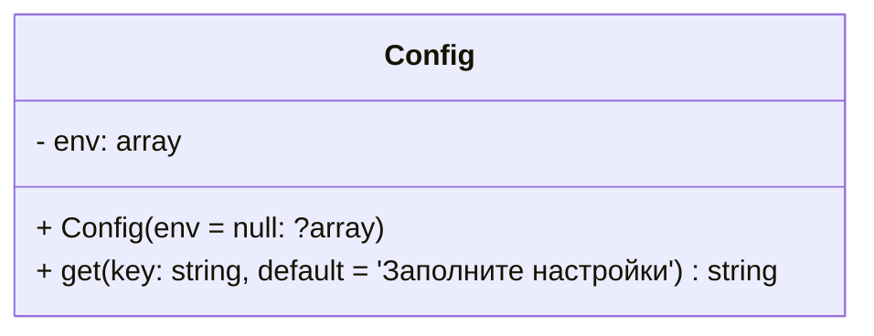
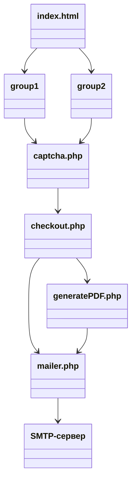

<div align="center">
  <a id="russian"></a>
  <h1>send-invoice: Калькулятор заказа с генерацией счёта и отправкой на email</h1>

  
  
  
  
  
</div>

  > **Author:** Alexandr Anatoliev

  > **GitHub:** [AlexandrAnatoliev](https://github.com/AlexandrAnatoliev)

---

<div align="center">
  <h2>Навигация</h2>
</div>

* [Техническое задание](#technical-specifications)
* [Общая архитектура](#architecture)
* [Требования к серверу](#requirements)
* [Разное](#other)

---

<div align="center">
  <a id="technical-specifications"></a>
  <h2>Техническое задание</h2>
</div>

```
Нужен скрипт калькулятора-заказа на php с радиокнопками, чекбоксами, 
картинками, полем ввода количества, расчётом итоговой суммы заказа 
и отправкой готового счета на оплату (в pdf или html с возможностью 
сохранения покупателем из письма в pdf) на почту покупателя и админа. 
Проведение онлайн оплаты не нужно, только отправка.
```

### Чек-лист требований

#### 1. Общая информация

* [ ] PHP-калькулятор заказа, без онлайн-оплаты, с отправкой счёта на email
* [ ] Два типа пользователей: Покупатель и Администратор

#### 2. Фронтенд

* [x] HTML-страница для выбора категории товаров
* [ ] PHP-страница для оформления заказа
  * [x] Радиокнопки для выбора основного товара
  * [x] Чекбоксы для дополнительных опций
  * [x] Тиражное ценообразование для дополнительных опций
  * [x] Поле количества (до 1000 шт, выпадающий список)
  * [ ] Динамический пересчёт цен и итоговой суммы
  * [ ] Выделение выбранных опций (цвет, список внизу)
    * [ ] Блок «Выбрано» с перечнем позиций до поля количества
  * [ ] Блок «Итого»
  * [x] Поля: Название организации, Телефон, Email, Количество
  * [ ] Валидация Email и Телефона (на клиенте и сервере)
  * [ ] Выделение незаполненных полей красной рамкой
  * [x] Кнопка отправки заказа
  * [x] Кнопка return to index.html
  * [ ] Математическая CAPTCHA
  * [ ] Rate limiting (ограничение частоты отправки с одного IP)

#### 3. Безопасность и структура

* [x] Масштабируемость и поддерживаемость проекта
  * [x] ООП подход к написанию кода
  * [x] TDD подход к написанию тестов
* Простая файловая «админка» через редактирование файлов
  * [x] index.html
  * [x] group/index.php, изменение
    * [x] названий товаров
    * [x] картинок товаров
    * [x] цен товаров
* [x] Хранение паролей и ключей в .env
* [x] Основной код скрыт в отдельных PHP-файлах
* [x] Строгая типизация, управление выводом ошибок
* [ ] Закрыт прямой доступ к .env и служебным файлам через .htaccess

#### 4. Счёт на оплату

* [x] Бланк строгой формы (как в 1С), чёткие рамки
* [x] Нумерация: Счёт № Б-12345678-987654 от ДД.ММ.ГГГГ
* [x] Реквизиты продавца из конфига, реквизиты покупателя из формы
* [x] Каждая выбранная позиция — отдельной строкой
* [ ] Отправка счёта в формате PDF как вложение
* [ ] Копия письма администратору
* [ ] QR-code для оплаты

#### 5. Документация и развёртывание

* [ ] README с инструкцией по установке (включая хостинг без SSH)
* [ ] Комментарии в коде
* [ ] Лёгкая смена товаров и цен

---

<div align="center">
  <a id="architecture"></a>
  <h2>Общая архитектура</h2>
</div>

<div align="center">
  <h3>Файловая структура</h3>
</div>

```
.
├── checkout.php
├── composer.json
├── composer.lock
├── configs
│   ├── .env
│   └── .env.example
├── coverage/
├── group1
│   ├── img
│   │   ├── Addon
│   │   │   ├── print_on_clip.png
│   │   │   ├── print_on_colored_case.png
│   │   │   └── print_on_white_case.png
│   │   └── Item
│   │       ├── lychee_pen.jpg
│   │       ├── ocean_pen.jpg
│   │       └── senator_pen.jpg
│   └── index.php
├── group2
│   ├── img
│   │   ├── Addon
│   │   │   ├── print_on_clip.png
│   │   │   ├── print_on_colored_case.png
│   │   │   └── print_on_white_case.png
│   │   └── Item
│   │       ├── lychee_pen.jpg
│   │       ├── ocean_pen.jpg
│   │       └── senator_pen.jpg
│   └── index.php
├── img
│   └── lychee_pen.jpg
├── index.html
├── phpunit.xml.dist
├── README.md
├── src/
│   ├── Addon.php
│   ├── Card.php
│   ├── Config.php
│   ├── FormElement.php
│   ├── Invoice.php
│   ├── Item.php
│   └── Selector.php
├── styles/
│   ├── Card.css
│   ├── index.css
│   ├── Invoice.css
│   └── Selector.css
├── tests
│   ├── AddonTest.php
│   ├── ConfigTest.php
│   ├── HealthTest.php
│   ├── InvoiceTest.php
│   ├── ItemTest.php
│   └── SelectorTest.php
├── utils
│   └── session.php
└── vendor
    ├── autoload.php
    ├── bin
    ├── composer
    ├── graham-campbell
    ├── myclabs
    ├── nikic
    ├── phar-io
    ├── phpoption
    ├── phpunit
    ├── sebastian
    ├── symfony
    ├── theseer
    └── vlucas
```

<div align="center">
  <h3>Структура классов</h3>
</div>

```mermaid
classDiagram
  
  class FormElement {
    # name: string
    + static getCSS() string
    + FormElement(name: string)
    + getName() string
    + render() string*
  }

  class Selector {
    # min: int
    # max: int
    # step: int
    + Selector(name: string, min: int, max: int, step: int)
    + getMin() int
    + getMax() int
    + getStep() int
    + render() string
  }

  class Invoice {
    - config: Config
    - customerPhone: string
    - customerName: string
    - selectedItem: Item 
    - quantity: int 
    - selectedAddons: array 
    - addons: array 
    + Invoice(
      name: string,
      config: Config,
      customerPhone: string,
      customerName: string,
      selectedItem: Item,
      quantity: int,
      selectedAddons: array,
      addons: array) 
    + getItem() Item
    + getQuantity() int
    + getSelectedAddons() array
    + getAddons() array
    + render() string
    + renderMainTable() string
    + getInvoiceNumber() string 
    + formatPhoneNumber(customerPhone: string) string
    + renderMiddleTable() string 
    + renderItemsTable() string
    + morph(n: int|string, f1: string, f2: string, f5: string) string
    + num2words(num: float|int|string ) string
  }

  class Card {
    # price: int
    # image: string
    + Card(name: string, price: int, image: string)
    + getPrice(quantity: int = null) int
    + getImage() string
  }

  class Item {
    + render() string
  }

  class Addon {
    - priceTiers: array
    + setPriceTier(quantity: int, price: int)
    + render() string
    + getPrice(quantity = null) int
  }

  FormElement  <|-- Selector
  FormElement  <|-- Invoice
  FormElement  <|-- Card
  Card <|-- Item
  Card <|-- Addon

```



<div align="center">
  <h3>Структура вызовов</h3>
</div>



<div align="center">
  <a id="requirements"></a>
  <h2>Требования к серверу</h2>
</div>

* PHP: версия 8.1 и выше
* Composer: менеджер пакетов PHP
* Библиотеки (устанавливаются через Composer):
  * vlucas/phpdotenv: версия 5.6 и выше

<div align="center">
  <h3>Установка Composer</h3>
</div>

#### Ubuntu/Debian

```
sudo apt update
sudo apt install composer -y
```

<div align="center">
  <h3>Установка библиотек</h3>
</div>

#### Ubuntu/Debian

В корневой папке проекта выполнить:

```
composer install
```

<div align="center">
  <a id="other"></a>
  <h2>Разное</h2>
</div>

* Запуск всех тестов с автоматической генерацией покрытия (HTML-отчёт в папке `coverage/`):

```
vendor/phpunit/phpunit/phpunit
```

* Обновить карту классов в `vendor/composer/autoload_*.php`

```
composer dump-autoload
```

* Удалить кэш phpactor

```
rm -rf ~/.cache/phpactor ~/.local/share/nvim/phpactor
```

* Перезапустить phpactor

```
:lsp restart phpactor
```
