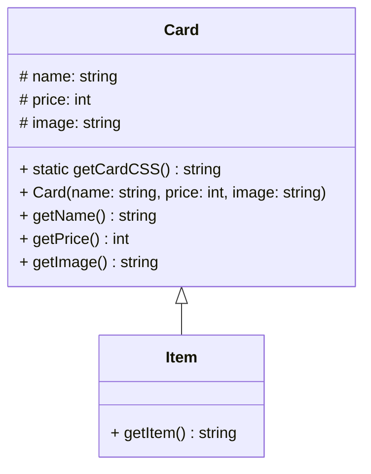

<div align="center">
  <a id="russian"></a>
  <h1>send-invoice: Калькулятор заказа с генерацией счёта и отправкой на email</h1>

  
  
  
  
  
</div>

  > **Author:** Alexandr Anatoliev

  > **GitHub:** [AlexandrAnatoliev](https://github.com/AlexandrAnatoliev)

---

<div align="center">
  <h2>Навигация</h2>
</div>

* [Общая архитектура](#architecture)

---

<div align="center">
  <a id="architecture"></a>
  <h2>Общая архитектура</h2>
</div>

<div align="center">
  <h3>Файловая структура</h3>
</div>

```
.
├── composer.json
├── composer.lock
├── coverage/
├── img/
│   └── Item/
│       ├── lychee_pen.jpg
│       ├── ocean_pen.jpg
│       └── senator_pen.jpg
├── index.php
├── README.md
├── src/
│   ├── Card.php
│   └── Item.php
├── styles/
│   ├── Card.css
│   └── index.css
├── tests
│   └── ItemTest.php
└── vendor
    ├── autoload.php
    ├── bin
    ├── composer
    ├── myclabs
    ├── nikic
    ├── phar-io
    ├── phpunit
    ├── sebastian
    └── theseer
```

<div align="center">
  <h3>Структура классов</h3>
</div>



* Запуск тестов и покрытие тестами:

```
vendor/phpunit/phpunit/phpunit
```
